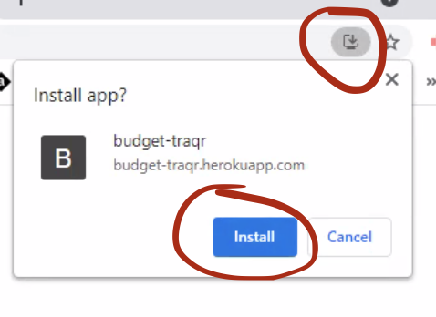
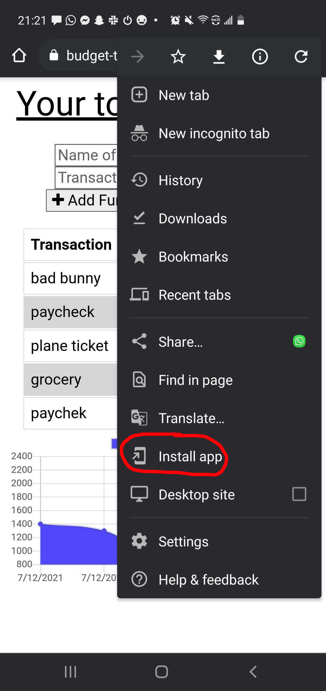
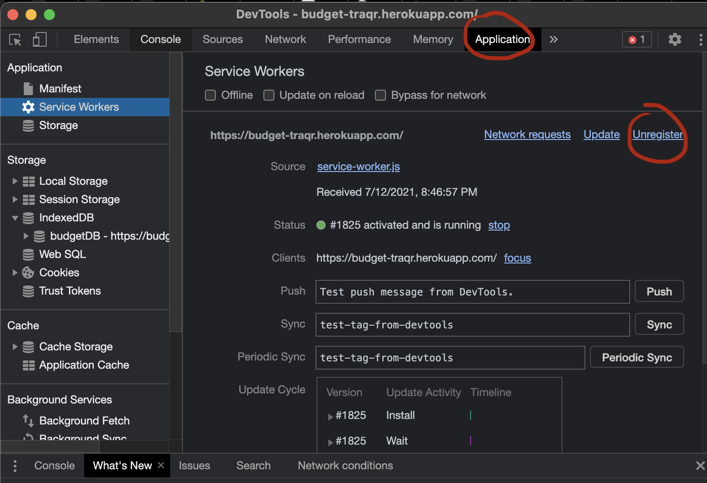

# Budget Tracker
A progressive web app to track your budget, even when you're offline.

## Table of Contents
* [Installation Guide](#Installation)
* [How to Use](#Usage)
* [Troubleshooting](#Troubleshooting)
* [License](#License)
* [Contact Info](#Contact)

## Installation
To use this locally, this app requires Node.js to install and use. The package.json is already provided, so navigate to the project folder and run `npm install`. Or skip all that and simply head over to the live site on [Heroku here](https://budget-traqr.herokuapp.com/).

## How to Use

Initially, you will need an internet connection the first time you visit the app to be able to download it. You can download the program by pressing the install button at the end of your URL bar on desktop, or by pressing more options on mobile.

Once visited, you can use it offline! The app uses IndexedDB to save to your local storage. Once you're back online, your data will get pushed to the MongoDB. Use the application to track any spending or funds coming your way. :)

## Troubleshooting

If you're having trouble accessing the application, try resetting your cache and/or unregistering your service worker.

## License
This project is licensed under the MIT license.

©[corgimaman](https://github.com/corgimaman)

## Contact
Questions? Comments? Feel free to reach out to me at helloidaworld@gmail.com or on [GitHub](https://github.com/corgimaman).